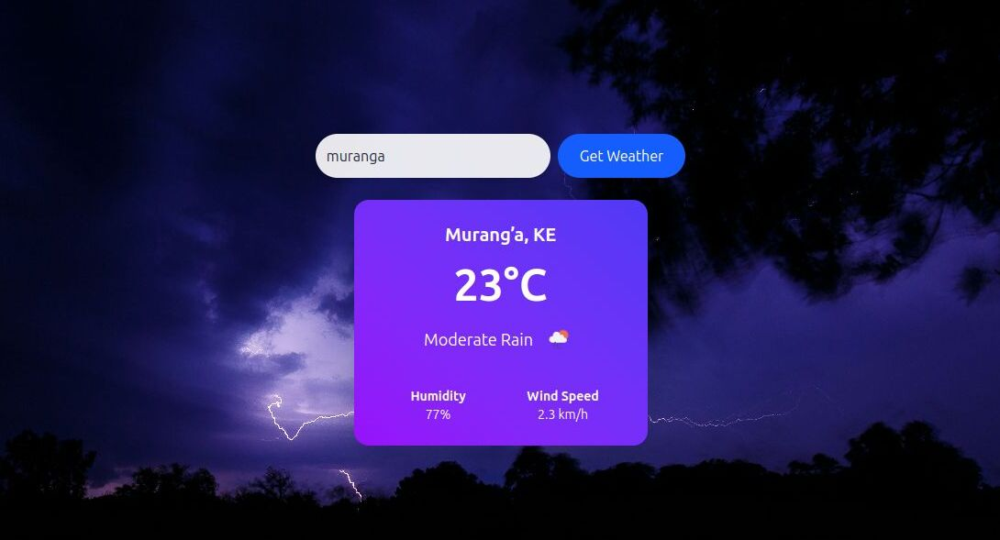

# 🌦️ Weather App

A sleek and modern weather application built using **React (Vite + TypeScript)** for the frontend and **Flask** for the backend. The app fetches real-time weather data using the **OpenWeatherMap API**, and features a card-based UI styled with **Tailwind CSS**.

 

---

## 🚀 Features

- 🌍 Search for weather by city name
- 🌡️ Displays temperature, humidity, and wind speed
- 🌈 Beautiful, responsive weather cards with background image or gradient
- ⚡ Fast client-side app built with Vite
- 🧠 Backend server built with Flask to handle API requests securely
- 🎨 Tailwind CSS for easy, utility-first styling

---

## 🛠️ Tech Stack

| Layer      | Tech           |
|------------|----------------|
| Frontend   | React, Vite, TypeScript, Tailwind CSS |
| Backend    | Flask (Python) |
| API Source | OpenWeatherMap API |

---

## 📦 Installation

### 1. Clone the Repository

```bash
git clone git@github.com:ngugilovesyou/weather_app.git
cd weather_app
```

### 🔧 2. Setup Backend (Flask)

```bash
cd server
python3 -m venv venv
source venv/bin/activate  # For Windows: venv\Scriptsctivate
pip install -r requirements.txt
```

🔑 **Add Your API Key**  
Create a `.env` file in the backend folder and add:

```ini
OPENWEATHER_API_KEY=your_api_key_here
```

Then run the Flask server:

```bash
flask run
```

Flask will run on `http://localhost:5000`.

### 🎨 3. Setup Frontend (React + Vite + Tailwind)

```bash
cd client
npm install
npm run dev
```

Frontend will run on `http://localhost:5173`.

### 🌐 API Endpoint  
Your frontend fetches weather data from:

```http
GET /api/weather?city=CityName
```

The Flask backend handles the OpenWeather API request and returns the data to the frontend.

### 📁 Project Structure

```bash
weather_app/
│
├── server/              # Flask API
│   ├── app.py
│   ├── .env
│   └── requirements.txt
│
├── frontend/             # React app (Vite + TS + Tailwind)
│   ├── src/
│   ├── public/
│   └── vite.config.ts
│
└── README.md
```

### 📸 UI Preview  
The UI is inspired by beautiful gradient weather cards and supports background images for a more engaging look.

### 🧪 To Do / Improvements

- 🌍 Add location-based auto-fetch
- 📆 Forecast for the next few days
- 🌘 Light/dark mode toggle
- 🐳 Dockerize for easy deployment

### 📄 License  
MIT License. Feel free to use and modify this project.

### 👨‍💻 Author  
Samuel Gitau  
amsamgitau@gmail.com

### ⭐️ Show Your Support  
If you liked this project, feel free to star it or contribute by submitting PRs!
